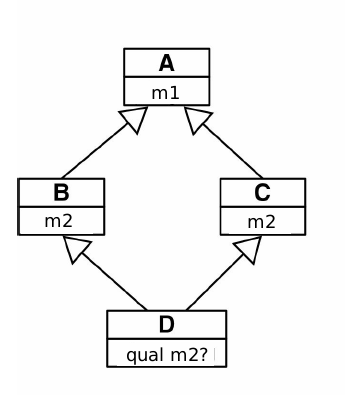
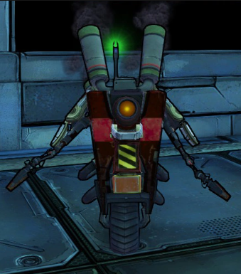
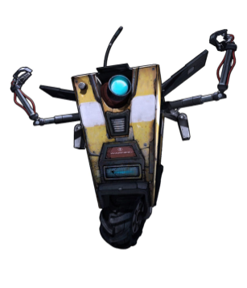

# CPP Module 03 - Introdução a Herança em C++
Este é o repositório da lista de exercícios CPP-03 da Escola 42. Nesta lista, você encontrará uma série de exercícios práticos para praticar e aprimorar seus conhecimentos em C++, com foco em herança.

## Tópico Foco
Neste módulo, daremos um enfoque em herança.

## Conceito de Herança em C++
Em C++, a herança é um conceito fundamental da programação orientada a objetos (POO) que permite criar novas classes (chamadas classes derivadas ou subclasses) a partir de classes existentes (chamadas classes base ou superclasses). 
A herança permite que as subclasses herdem os membros (atributos e métodos) da classe base, possibilitando a reutilização de código e a criação de uma hierarquia de classes.

A classe derivada herda todos os membros públicos e protegidos da classe base, e pode adicionar novos membros ou modificar os membros herdados de acordo com suas necessidades. Isso permite estender ou especializar o comportamento da classe base na classe derivada.

A herança em C++ é implementada usando a palavra-chave class ou struct, seguida pelo nome da classe derivada, seguida pela palavra-chave :, seguida pelo nome da classe base da qual a classe derivada irá herdar. 

```cpp
class Base {
    // membros da classe base
};

class Deriva : public Base {
    // membros da classe derivada
};
```

Neste exemplo, a classe Deriva está herdando publicamente da classe Base. Isso significa que os membros públicos da classe Base serão acessíveis diretamente na classe Derived. Existem também outros tipos de herança, como herança protegida e herança privada, que controlam a visibilidade dos membros herdados.

A herança permite criar relacionamentos hierárquicos entre classes, modelando conceitos de generalização e especialização. Ela é amplamente utilizada para criar hierarquias de classes, implementar polimorfismo, compartilhar funcionalidades comuns e organizar o código de forma modular e reutilizável.

## O problema da Herança em Diamante
A herança em diamante, também conhecida como ambiguidade de herança ou problema do diamante, é uma situação que ocorre quando uma classe derivada herda de duas classes que possuem uma classe em comum como ancestral em comum. Essa situação forma uma estrutura em forma de diamante, daí o nome.



O problema surge quando a classe derivada tenta acessar membros ou métodos da classe ancestral comum. Como existem duas cópias dessa classe, pode haver ambiguidade na resolução de qual versão usar.

A herança em diamante é uma limitação do modelo de herança tradicional em C++, onde a herança é baseada em classes. Para lidar com esse problema, o C++ introduziu a herança virtual. A herança virtual permite que a classe derivada tenha apenas uma instância da classe ancestral em comum, resolvendo assim a ambiguidade.

Ao usar herança virtual, a classe derivada declara a herança das classes ancestrais como virtual. Por exemplo:
```cpp
class A { /* ... */ };

class B : virtual public A { /* ... */ };

class C : virtual public A { /* ... */ };

class D : public B, public C { /* ... */ };
```
Ao usar a herança virtual, a classe D terá apenas uma instância da classe A, mesmo que seja herdada por meio de várias classes. Isso resolve o problema da ambiguidade de herança em diamante.

É importante observar que a herança virtual pode ter um custo de desempenho ligeiramente maior, pois requer uma tabela de ponteiros virtual adicionada às classes envolvidas. Portanto, é recomendável usar herança virtual apenas quando necessário para evitar ambiguidades de herança.

## Sombreamento de Membros Herdados

### Sombreamento:

O sombreamento (shadowing) ocorre quando uma variável local em um escopo interno tem o mesmo nome que uma variável em um escopo externo. Isso faz com que a variável externa seja "ofuscada" ou "sombreada" pela variável interna dentro do escopo local. Como resultado, as referências à variável dentro do escopo interno se referem à variável local, em vez da variável externa com o mesmo nome.

O sombreamento pode ser intencional, usado para limitar o escopo de uma variável e evitar conflitos com outras variáveis do mesmo nome em escopos externos. No entanto, o sombreamento acidental ou não intencional pode levar a erros sutis e difíceis de depurar, pois as referências à variável podem se tornar ambíguas.

### Sombreamento em Herança:
O sombreamento em herança ocorre quando uma classe derivada possui um membro (método ou atributo) com o mesmo nome que um membro da classe base. Nesse caso, o membro da classe base é "sombreado" e fica inacessível na classe derivada, a menos que seja explicitamente qualificado com o nome da classe base.

Quando um membro é sombreado em uma classe derivada, isso significa que a classe derivada tem seu próprio membro com o mesmo nome, que tem prioridade sobre o membro da classe base. Isso pode levar a comportamentos inesperados, pois as chamadas de membro na classe derivada podem se referir ao membro sombreado em vez do membro da classe base.

Para acessar o membro da classe base sombreado, é necessário utilizar a resolução de escopo com o nome da classe base. Por exemplo, se uma classe derivada chamada `Derived` sombreia um membro chamado `Member` da classe base `Base`, é possível acessar o membro da classe base usando `Base::member`.

O sombreamento em herança pode ser útil em certos casos quando se deseja substituir completamente o membro da classe base com uma implementação diferente na classe derivada. No entanto, é importante ter cuidado ao usar o sombreamento, pois pode levar a confusões e erros sutis se não for tratado corretamente. É recomendável evitar o sombreamento, a menos que haja uma necessidade específica para isso e se tenha um entendimento claro do seu impacto no design da classe.

## Os sinalizadores de compilador 'Wshadow' e 'Wno-shadow'

Os sinalizadores de compilador `-Wshadow` e `-Wno-shadow` estão relacionados à verificação e tratamento de variáveis com sombreamento (shadowing) em C++.

O sinalizador de compilador `-Wshadow` ativa avisos de sombreamento durante a compilação. O sombreamento ocorre quando uma variável em um escopo interno tem o mesmo nome de uma variável em um escopo externo. Isso pode tornar o código confuso e propenso a erros, pois as referências a variáveis podem ser ambíguas. O uso do sinalizador `-Wshadow` permite que o compilador emita avisos quando ocorrer sombreamento de variáveis, para que você possa corrigir o código e evitar possíveis problemas.

Já o sinalizador `-Wno-shadow` desativa os avisos de sombreamento durante a compilação. Isso significa que o compilador não emitirá avisos quando ocorrer sombreamento de variáveis. Essa opção pode ser útil se você estiver ciente do sombreamento e quiser evitar a exibição dos avisos durante a compilação.

É importante considerar cuidadosamente o uso desses sinalizadores. O sombreamento intencional pode ser útil em alguns casos para limitar o escopo de uma variável e evitar conflitos. No entanto, o sombreamento acidental ou não intencional pode levar a erros difíceis de depurar. Portanto, é recomendável analisar os avisos de sombreamento e corrigir o código, a menos que haja uma razão válida para permitir o sombreamento.

**Lembre-se de incluir o `-Wshadow` nas flags do Makefile!**

## Para você conhecer os personagens desta lista:

Esta lista é baseada em robozinhos da franquia de games Borderlands. Os robos atacam, levam dano, se defendem e se curam de acordo com suas características.

**ClapTrap:** Claptrap é um robô de uso geral CL4P-TP fabricado pela Hyperion . Ele foi programado com uma personalidade excessivamente entusiasmada e se gaba com frequência, mas também expressa severa solidão e covardia.


**Sc4v-TP:** SC4V-TP é leal a RedBelly, e atua como um porteiro em Triton Flats, na entrada principal da fortaleza de RedBelly, em Crisis Scar. Ele é um dos dos guardas que deve ser derrotado para se acessar a fortaleza. 



**FragTrap:** é um Claptrap em particular que foi reprogramado por Handsome Jack em um papel de combate ativo e renomeado para "Fragtrap".



#### Referências das imagens:
- https://www.shoptoys.com.br/colecionaveis/action-figures/outros/the-coop-borderlands-3-claptrap-7-oficial-licenciado
- https://borderlands.fandom.com/wiki/SC4V-TP
- https://br.pinterest.com/pin/525443481504305973/
- https://www.alura.com.br/apostila-python-orientacao-a-objetos/heranca-multipla-e-interfaces